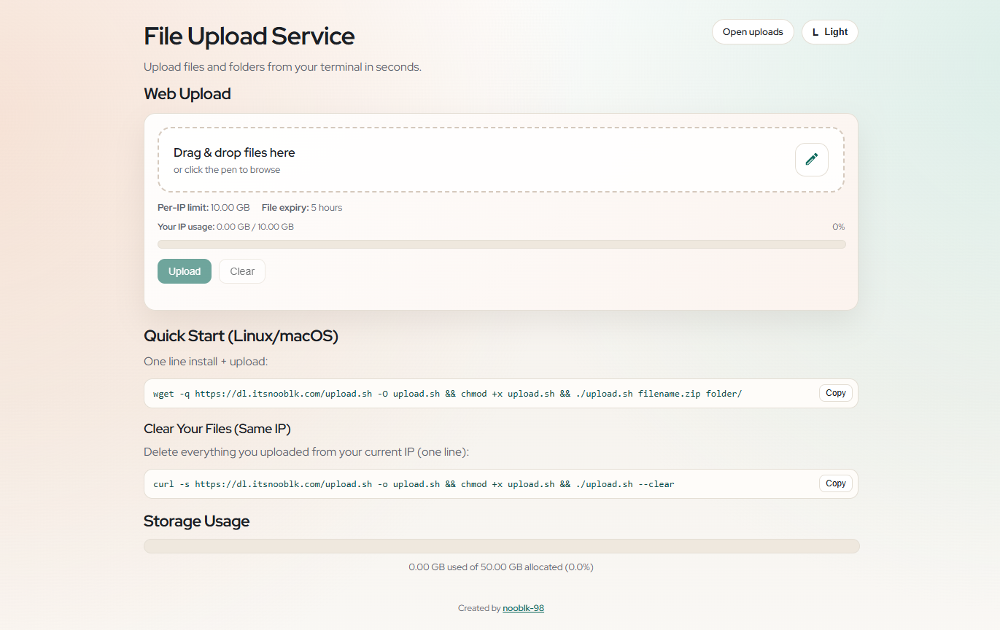
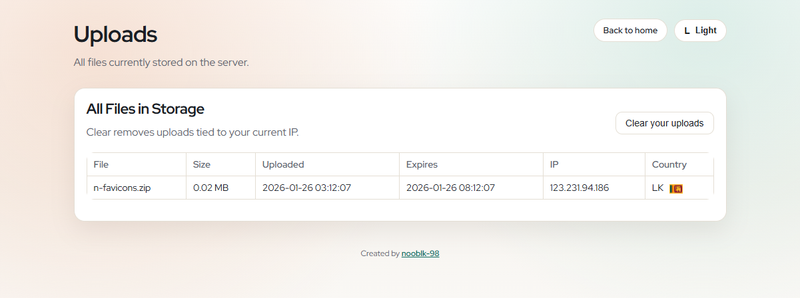

<div align="center">
  

# Temp File Share

**Upload files and folders from your terminal and get a download link.**

[](http://www.gnu.org/licenses/agpl-3.0)

</div>

---

## UI Screenshots


---


---

### What is included

- Terminal upload script with link output.
- Auto-zip for folders and multi-file uploads.
- Automatic expiry and cleanup.
- Per-IP storage limits and cooldowns.
- Simple web UI listing uploaded files with expiry times.

---

## Features

### Security and hardening
- Per-IP limits and cooldowns to reduce abuse.
- Expired files are removed automatically.
- Server resolves client IP via `X-Real-IP` / `X-Forwarded-For` when behind a proxy.

### Upload experience
- One-command upload for files and folders.
- Clear command to remove all uploads for the current IP.
- Download link returned immediately.

### Operations and observability
- Simple upload and download flow with clear terminal output.
- UI shows upload time and expiry time per file.

### Flexibility
- Works for single files or folders (auto-zipped).
- Compatible with Linux/macOS terminals.

---

## Quick Start

### Option 1: One line install + upload (recommended)

```bash
wget -q https://dl.itsnooblk.com/upload.sh -O upload.sh && chmod +x upload.sh && ./upload.sh filename.zip folder/
```

Sample output:
```text
https://dl.itsnooblk.com/download/a64c76df94664379815186a6cf9c55e7_upload_1769362635.tar.gz
Your IP: 80.225.221.245
File size: 0.03 MB
Expires: 2026-01-25 22:37:16
Disk space left: 117.48 GB
Allocated space remaining: 50.00 GB
IP limit remaining: 10.00 GB
```

### Option 2: Clear your files (same IP)

```bash
curl -s https://dl.itsnooblk.com/upload.sh -o upload.sh && chmod +x upload.sh && ./upload.sh --clear
```

---

## Configuration

Notes:

- Folders and multiple files are auto-zipped before upload.
- Files are stored with UUID names.
- Expired files are cleaned up automatically.
- Limits apply per IP.
- If you hit the IP limit, run `./upload.sh --clear` and try again.

---

## Monitoring and health

- Use the terminal output to verify upload, size, and expiry time.
- Check the UI to confirm listings and expiry timestamps.

---

## Troubleshooting

- If uploads are blocked by IP limits, run `./upload.sh --clear`.
- If you are behind a reverse proxy, ensure it forwards `X-Real-IP` or `X-Forwarded-For`.

---

## Contributing

1) Fork and create a feature branch. 2) Make changes with tests or manual checks. 3) Update documentation when behavior changes. 4) Open a PR with a clear summary.

---

## 📝 License

This project is licensed under the **GNU Affero General Public License v3.0** (AGPL-3.0).
See [LICENSE](LICENSE) for full details.

---

<div align="center">

**Made with ❤️ by NoobLK**

[⬆ Back to top](#temp-file-share)

</div>
