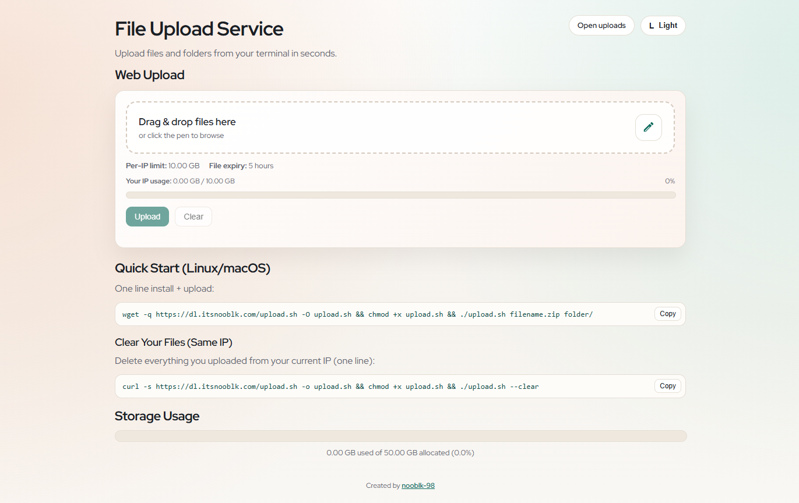

<div align="center">
  

# Temp File Share

**Upload files and folders from your terminal and get a shareable download link.**

[](https://www.python.org/)
[](https://www.docker.com/)
[](LICENSE)
[](app/requirements.txt)

[Features](#features) • [Quick Start](#quick-start) • [Usage](#usage) • [API](#api) • [Configuration](#configuration) • [Deployment](#deployment)

<br>

[](images/ui.png)

</div>

A lightweight file sharing server with zero external dependencies. Upload files from your terminal, get a download link, and the files expire automatically. Folders and multiple files are zipped on the client side before upload.

> [!TIP]
> Try it in one command: `curl -s https://dl.itsnooblk.com/upload.sh | bash -s -- <file>`

---

## Features

**Simple sharing workflow**

- Upload files, folders, or multiple items at once with a single command
- Folders are automatically compressed into a tarball before upload
- Each upload returns a download link immediately

**Built-in abuse protection**

- Per-IP storage quotas prevent excessive usage
- Configurable rate limiting between uploads
- Automatic expiry and cleanup of old files on a background schedule

**Observability**

- Web UI shows storage usage, recent uploads, and expiry times
- Country flags are resolved from IP addresses via geo-lookup
- Server logs include upload, download, and clear events

**Operations friendly**

- Proxy-aware: respects `X-Real-IP` and `X-Forwarded-For` headers
- No build step, no package manager, no database setup
- Runs on any system with Python 3.9+

---

## Quick Start

### One-liner upload

```bash
curl -s https://dl.itsnooblk.com/upload.sh | bash -s -- ./document.pdf
```

### Run the server with Docker

```bash
docker run -d \
  -p 54000:54000 \
  -v uploads:/app/uploads \
  -v data:/app/data \
  --restart unless-stopped \
  ghcr.io/nooblk-98/temp-file-share:latest
```

### Run the server from source

```bash
git clone https://github.com/nooblk-98/temp-file-share.git
cd temp-file-share/app
mkdir uploads data
python3 backend.py
```

> [!TIP]
> Edit `app/config.json` before starting the server to set your domain, storage limits, and expiry duration.

---

## Usage

### Upload files

The `upload.sh` script detects whether you're uploading a single file, multiple files, or a directory:

```bash
# Single file
./upload.sh document.pdf

# Multiple items
./upload.sh photos/ documents/ notes.txt

# Directory (auto-zipped)
./upload.sh my-project/
```

**Sample output:**

```
Single file detected, uploading directly: document.pdf
Uploading...
https://dl.itsnooblk.com/download/a64c76df94664379815186a6cf9c55e7_document.pdf
Your IP: 80.225.221.245
File size: 0.03 MB
Expires: 2026-01-25 22:37:16
Disk space left: 117.48 GB
Allocated space remaining: 50.00 GB
IP limit remaining: 10.00 GB
```

### Clear your uploads

Remove all files uploaded from your IP address:

```bash
./upload.sh --clear
```

### Use a remote server

Set the `BACKEND_URL` environment variable to point to a remote instance:

```bash
export BACKEND_URL=https://dl.itsnooblk.com
./upload.sh document.pdf
```

> [!NOTE]
> The upload script is served directly by the server at `GET /upload.sh`, so clients can fetch it without cloning the repo.

---

## API

### Upload a file

```bash
POST /upload
```

Accepts `multipart/form-data` (with a `file` field) or raw binary body.

```bash
# Multipart upload
curl -X POST -F "file=@photo.jpg" http://localhost:54000/upload

# Raw binary upload
curl -X POST -H "Content-Type: application/octet-stream" \
  --data-binary @photo.jpg http://localhost:54000/upload
```

**Response:** Plain text with the download URL, your IP, file size, expiry time, and remaining quotas.

### Download a file

```bash
GET /download/<filename>
```

```bash
curl -O http://localhost:54000/download/<filename>
```

### Clear your files

```bash
POST /clear
```

Deletes all files uploaded from your IP address.

```bash
curl -X POST http://localhost:54000/clear
```

### Web UI

| Route | Description |
|---|---|
| `GET /` | Main dashboard — storage usage, quotas, recent uploads |
| `GET /uploads` | Upload listing — file names, sizes, timestamps, country flags |
| `GET /upload.sh` | Download the client upload script |
| `GET /robots.txt` | Robots exclusion rules |
| `GET /sitemap.xml` | XML sitemap |

---

## Configuration

All settings are in `app/config.json`:

```json
{
  "UPLOAD_DIR": "uploads",
  "MAX_STORAGE_GB": 50,
  "MAX_AGE_HOURS": 5,
  "IP_LIMIT_GB": 10,
  "PUBLIC_BASE_URL": "https://dl.itsnooblk.com",
  "FILES_DB": "data/files_db.json",
  "RATE_LIMIT_SECONDS": 2,
  "CLEANUP_INTERVAL_SECONDS": 300
}
```

| Key | Default | Description |
|---|---|---|
| `UPLOAD_DIR` | `uploads` | Directory for stored files |
| `MAX_STORAGE_GB` | `50` | Total storage limit in GB |
| `MAX_AGE_HOURS` | `5` | File expiry in hours |
| `IP_LIMIT_GB` | `10` | Storage limit per IP address |
| `PUBLIC_BASE_URL` | `""` | Public-facing base URL for download links |
| `FILES_DB` | `data/files_db.json` | Path to the file metadata database |
| `RATE_LIMIT_SECONDS` | `0` | Cooldown between uploads (0 = disabled) |
| `CLEANUP_INTERVAL_SECONDS` | `300` | Expired file cleanup interval in seconds |

---

## Deployment

### Docker Compose

```yaml
services:
  backend:
    build: ./app
    network_mode: host
    volumes:
      - /opt/temp-file-share/uploads:/app/uploads
      - /opt/temp-file-share/data:/app/data
    restart: unless-stopped
```

```bash
docker compose up -d
```

### Reverse proxy (nginx)

```nginx
server {
    listen 443 ssl;
    server_name dl.example.com;

    location / {
        proxy_pass http://127.0.0.1:54000;
        proxy_set_header X-Real-IP $remote_addr;
        proxy_set_header X-Forwarded-For $proxy_add_x_forwarded_for;
        proxy_set_header X-Forwarded-Proto $scheme;
        client_max_body_size 0;
    }
}
```

> [!IMPORTANT]
> Set `PUBLIC_BASE_URL` in `config.json` to your public domain so download links resolve correctly. Without this, links will use whatever `Host` header the client sends.

---

## Project structure

```
├── app/
│   ├── app.py              # HTTP server (stdlib only)
│   ├── backend.py          # Entry point
│   ├── config.json         # Server configuration
│   ├── Dockerfile          # Container image
│   ├── pyproject.toml      # Project metadata
│   ├── requirements.txt    # Zero dependencies
│   ├── templates/          # HTML templates
│   ├── static/             # CSS and JS assets
│   └── scripts/            # Client upload script
├── docker-compose.yaml     # Production deployment
├── images/                 # Logo and screenshots
└── upload.sh               # Client upload script
```
